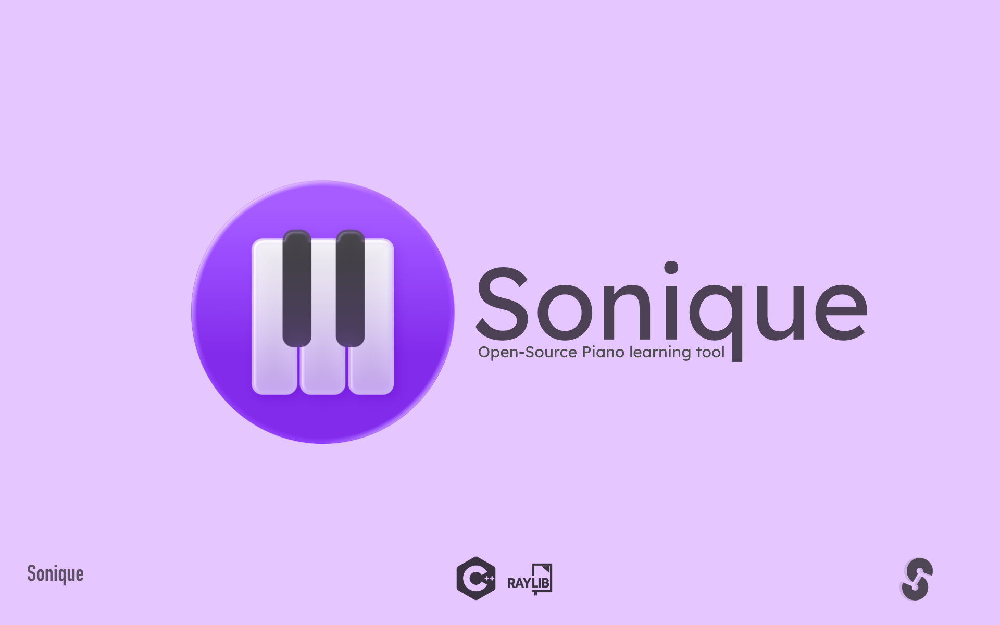
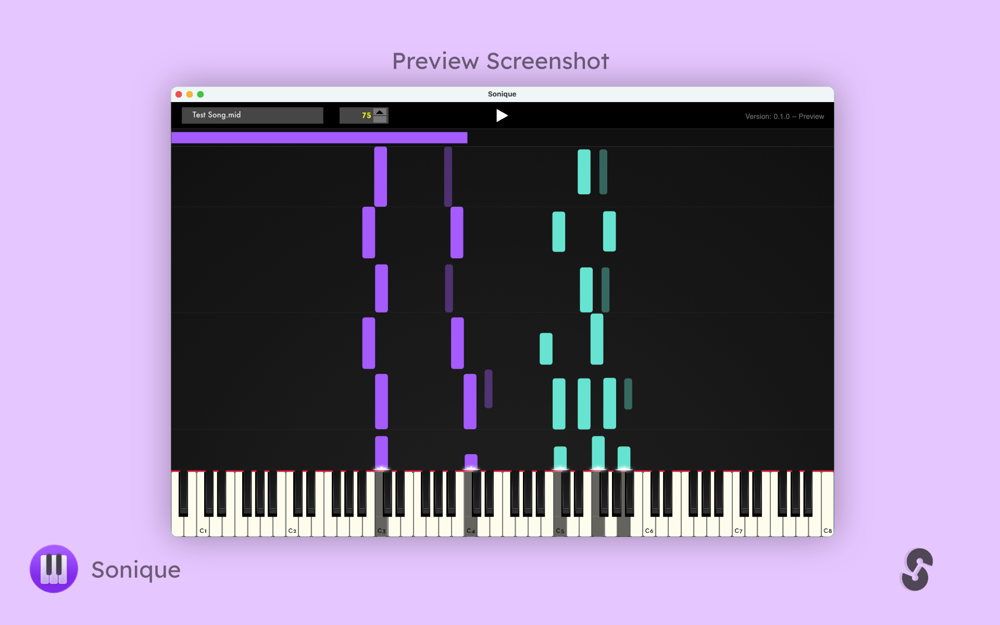

  

<h1 align="center">Sonique</h1>

**Sonique** is a solo-developed interactive piano visualization tool that transforms MIDI files into beautifully animated falling notes.
Designed for learners, performers, and music lovers, it offers a clean and responsive interface for playing, practicing, and simply enjoying music in real time.

> ⚠️ **Note:** Sonique is in early development and not yet feature-complete.

---

## Status

**Current Phase:** MVP Complete – Iterating

The first working version (MVP) is kinda ready:

* Real-time MIDI playback
* Smooth falling note animations
* A clean and functional user interface

I'm currently focused on improving stability, adding quality-of-life features, and expanding customization options.

---

## Images

---

## Technologies

* **C++** – Core programming language
* **Raylib** – Lightweight rendering and game loop library
* **RtMidi** – Cross-platform MIDI I/O
* **FluidSynth** – Software synthesizer for high-quality MIDI playback

---

## 🖥️ Platforms

Initial development is on **macOS**, which will be the first supported platform.
I also plan to support **Windows**, with potential **Linux** support depending on demand and time.

---

## Why Sonique?

Most MIDI visualizers do have some kind of cost and may also be a bit overcomplicated for some people

**Sonique** is free, will always be free. It is also open-source.

---

## Preview Download

> ⚠️ **Unstable Preview Build:** For testing only. Expect bugs and missing features.

Download the latest build:
[➡️ Sonique v0.1.0-preview](https://github.com/mattkje/sonique/releases/tag/0.1.0-preview)

---

## Coming Soon

Planned features: (no guarantee)

* Multiple MIDI input/output device support
* Customizable visual styles
* Playback controls (looping, seek bar, etc.)
* Recording and export options

---

## Feedback & Contributions

This is a solo project and still evolving — there's no strict roadmap or contribution guide yet.
That said, **ideas, suggestions, and feedback are always welcome**!
Feel free to open an issue or start a discussion on GitHub.
