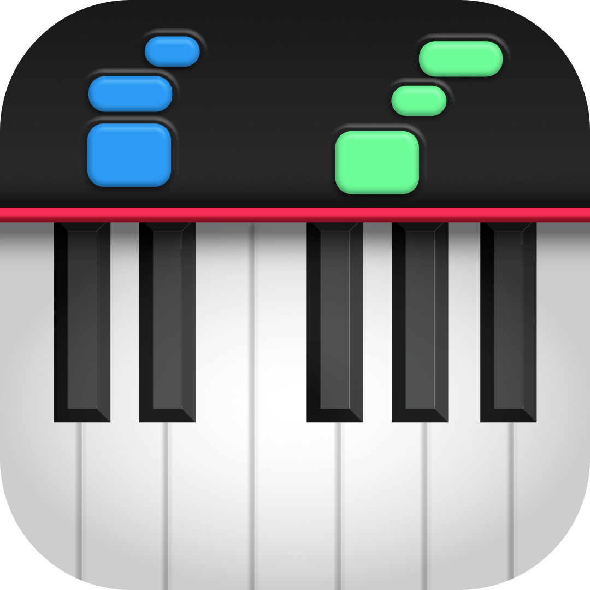

  

<h1 align="center">Sonique</h1>

**Sonique** is a solo-developed interactive piano visualization tool that transforms MIDI files into beautifully animated falling notes.
Designed for learners, performers, and music lovers, it offers a clean and responsive interface for playing, practicing, and simply enjoying music in real time.

> ⚠️ **Note:** Sonique is in early development and not yet feature-complete.

---

## 🚧 Project Status

**Current Phase:** MVP in Development

I'm currently focused on building the core experience: real-time MIDI playback, fluid note animations, and a lightweight, distraction-free UI.

---

## 🛠 Technologies Used

* **C++** – Core programming language
* **Raylib** – Lightweight rendering and game loop library
* **RtMidi** – Cross-platform MIDI input/output
* **FluidSynth** – Software synthesizer for high-quality MIDI playback

---

## 🖥 Planned Platforms

Platform support is still to be determined.
Since development is currently happening on macOS, that will be the initial supported platform. I also aim to add Windows support, with Linux as a potential target depending on demand and available time.
  
---

## 🎯 Why Sonique?

Most existing MIDI visualizers are **expensive**, **closed-source**, or **overcomplicated**.
As a solo dev, I want to create a free, open-source alternative for everyone to use
Music should be approachable, and tools like this shouldn’t be behind a paywall.

---

## 🧩 Coming Soon

Planned features include:

* Multiple MIDI input/output device support
* Customizable visual styles
* Playback controls (looping, seek bar)
* Recording and export tools

---

## 🙌 Support & Contributions
As this is a solo project still taking shape, I don’t have a concrete roadmap or contribution plan just yet.
That said, suggestions, ideas, or even casual feedback are always welcome — feel free to open an issue or start a discussion if something comes to mind

